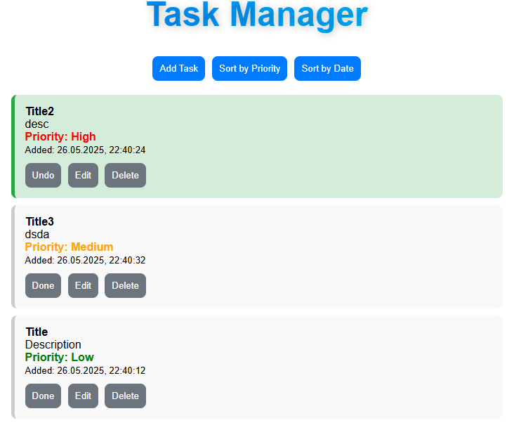

# 📝 Task Manager

A simple and intuitive web-based Task Manager built with HTML, CSS, and JavaScript.  
Easily add, edit, prioritize, and track tasks with sorting and filtering capabilities.

## 🚀 Features

- ✅ Add new tasks with title, date, time, and priority
- ✏️ Edit existing tasks
- 🔄 Mark tasks as completed or pending
- 🔺 Prioritize tasks (High, Medium, Low)
- 📅 Sort tasks by due date (ascending/descending)
- 📌 Sort tasks by priority
- 📂 Show completed tasks at the top
- 💾 All data is stored in the browser using `localStorage`

## 📸 App preview



## 📦 Technologies Used

- HTML5
- CSS3
- JavaScript (Vanilla)
- Browser `localStorage`

## 🛠 How to Use

1. Clone this repository:

   ```bash
   git clone https://github.com/9arks9/TaskManagerWeb.git
   cd TaskManagerWeb

